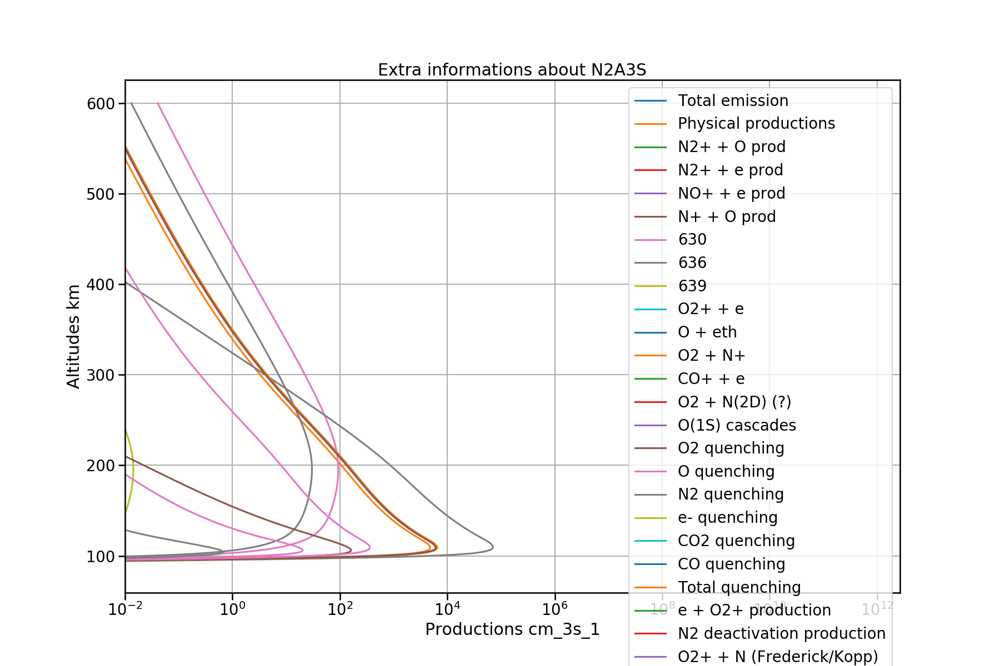
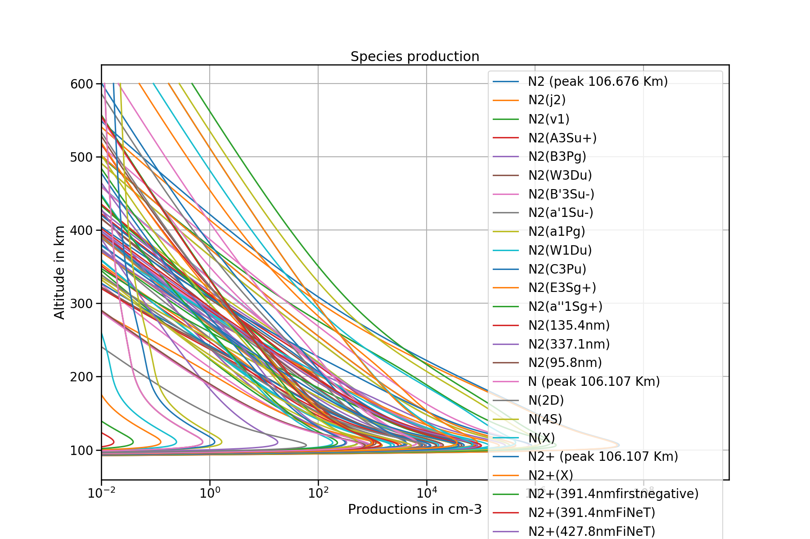

# Aeroplanets / Trans++: C++ implementation of the Trans* programs.


Aeroplanets is by
[Guillaume Gronoff](https://scholar.google.com/citations?user=e2RfvmYAAAAJ)
([ORCID](https://orcid.org/0000-0002-0331-7076))
of NASA, a former student of Pierre-louis Blelly, Transcar author.
Michael Hirsch upgraded the original autoconf build system to CMake and redid the plotting utilities.
Aeroplanets is a **1-D kinetic electron transport ionization and excitation model** for **aurora** and **airglow** on various planetary bodies including Earth, Venus, Mars and Titan, and has been used to help conceptualize thermospheres of exoplanets.
Impact kinetics are simulated for electrons, protons, photons and cosmic rays.
Transport of secondary particles and suprathermal electrons is also simulated.
Aeroplanets incorporates several models including:

* Trans4 (low energy proton model)
* Trans-Venus-Mars


Aeroplanets builds easily with CMake using Boost for C++.
Aeroplanets can be compared with other models like
[Glow](https://www.github.com/space-physics/glowaurora) or
[Transcar](https://www.github.com/space-physics/transcar).

The simulation is configured completely with XML.
The runtime is similar to Transcar (3-5 minutes on a laptop).
The output is text files, for which I have fast Python parsers that could dump to HDF5 etc. as desired.

Over 70 output files are created per simulation, covering:

* production rates for numerous neutral and ion species
* column emissions from UV to IR
* energy grid from 1 eV..30 keV

Inputs include:

* photon flux (photoionization)
* proton flux (proton impact ionization)
* electron flux (electron impact ionization) -- parameterization or read your e- flux file.

Bibliography

Aeroplanets was described in Section 2 of [JGRSP 2012](https://agupubs.onlinelibrary.wiley.com/doi/full/10.1029/2011JA016930).

* [JGRSP 2020: Atmospheric Escape Processes and Planetary Atmospheric Evolution](https://arxiv.org/pdf/2003.03231.pdf)
* [JGRSP 2012: Mars airglow](https://agupubs.onlinelibrary.wiley.com/doi/full/10.1029/2011JA017308)
* [GRL 2014: precipitation of keV energetic oxygen ions at Mars](https://agupubs.onlinelibrary.wiley.com/doi/10.1002/2014GL060902)
* [Astronomy & Astrophysics 2011: Ionization processes in the atmosphere of Titan](https://www.aanda.org/articles/aa/abs/2011/05/aa15675-10/aa15675-10.html)
* [2019 master's thesis on Mars proton/hydrogen aurora](https://search.proquest.com/docview/2288851551)


## Prereqs

The build system is CMake.

* Mac: NOTE: at the moment this might have regex.hpp error, I don't have access to MacOS for now.

    ```sh
    brew install cmake gcc boost lapack

    brew install doxygen  # optional
    ```
* Linux

    ```sh
    apt install g++ gfortran liblapack-dev libboost-filesystem-dev libboost-regex-dev

    apt install doxygen graphviz  # optional
    ```
* Windows: use [Windows Subsystem for Linux](https://www.scivision.dev/install-windows-subsystem-for-linux/)

Plotting uses Python and Matplotlib.

## Build

```sh
cmake -B build

cmake --build build
```

Compilation can use a few GB of RAM.
if this becomes an issue, try using `cmake -B build -G Ninja` or if you don't have Ninja, specify `cmake --build build -j1`

## Usage

NOTE: Trans++ has a bug where if the output directory doesn't exist,
the program just keeps computing, but doesn't write any output at all.

### Aurora example

From the aeroplanets/build/ directory:

1. create the output directory, or no files will be output at all despite full simulation run

   ```sh
   mkdir SortieAurora
   ```
2. run sim

   ```sh
   ./aero1d ../data/Earth/AuroraEarthFairbanks.xml
   ```
   the output appears under SortieAurora/


### Plot

Automatically iterates over all files in output directory.
From the aeroplanets/utils directory:

```sh
python Plot.py build/SortieAurora/
```

the optional `-p ~/plots` parameter saves plots to ~/plots/ directory.

`aeroplanets/data/Earth/SortieAuroraCompar/` is reference data to check if the compilation/computation was successful.







### Precipitation

Alfvenic aurora and other structured aurora users may be interested in configuring electron precipitation flux characteristics.
This is configured in the input XML file as follows:

1. `<use_precipitation />` must exist to enable electron precipitation, and the parameters are enclosed by `<precipitation>` `</precipitation>` XML tags.
2. Electron precipitation must be read from a file or computed by a simple parameterization.

`use_model`  (created in `math/mathflux.cpp`)

* 0: Null (none)
* 1: Maxwellian
* 2: Gaussian
* 3: Dirac (pseudo-monoenergetic)


* `E0`     Characteristic energy [eV]
* `entot`  Total flux [ergs]
* `isotro` 0: non-isotropic.  1: isotropic.
* `powlaw` power-law shaping 0 or 1


## Plotting

Several programs related to concurrent running of large numbers of simulations are in [utils/](./utils).
Most users will simply use `Plot.py` to make line plots of text output files, using headers.

Some examples from the
[1983 Venus VTS3 empirical model](https://doi.org/10.1029/JA088iA01p00073),
valid from about 140 km - 250 km altitude, done with Venus_*.py programs.


## Documentation

1. compile docs

   ```sh
   doxygen Doxyfile
   ```
2. web browser: `doc/html/index.html`
3. To create `/doc/latex/refman.pdf`:

   ```sh
   cd doc/latex
   make
   ```
